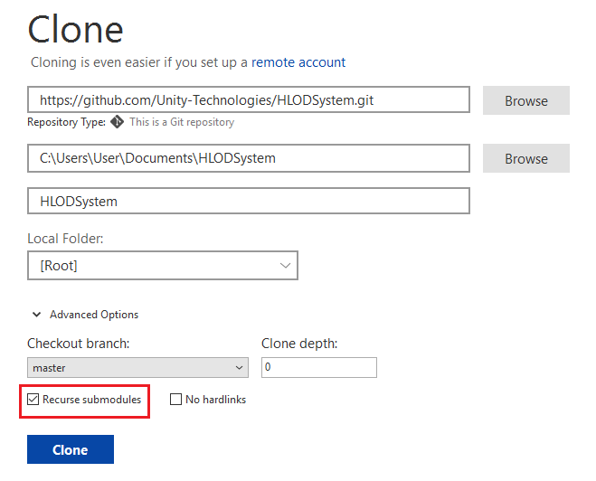
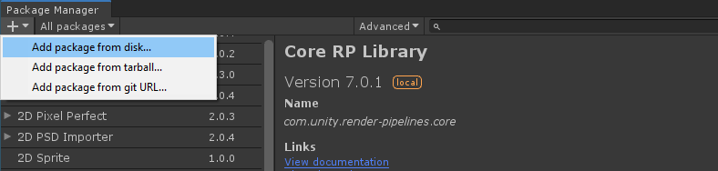
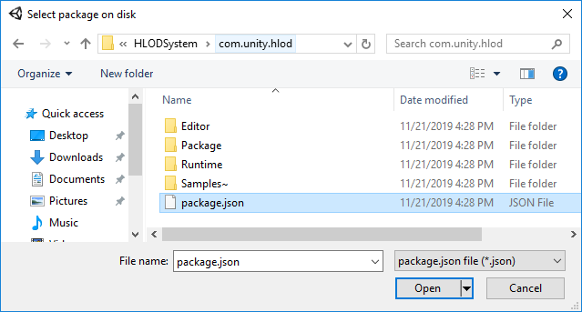

# Getting started

## Prerequisites
-   Git Client
-   Unity 2019.3+ (2019.2 works too, but 2019.3+ is recommended)
-   Unity Technologies GitHub Account

## Getting HLOD System
HLOD System is provided as an individual package. Currently it is available only on GitHub. In later stages of development, it will be available through Unity Package Manager.

HLOD System GitHub Repo URL is [https://github.com/Unity-Technologies/HLODSystem](https://github.com/Unity-Technologies/HLODSystem)

Follow through to get the package to your local PC and work with it.

### CLI

**Step 1.** Run one of the following commands to clone the repo:
`git clone https://github.com/Unity-Technologies/HLODSystem.git`

or

`git clone git@github.com:Unity-Technologies/HLODSystem.git`


```
user@DESKTOP /Dev$ git clone https://github.com/Unity-Technologies/HLODSystem.git
Cloning into 'HLODSystem'...
remote: Enumerating objects: 150, done.
remote: Counting objects: 100% (150/150), done.
remote: Compressing objects: 100% (110/110), done.
remote: Total 4179 (delta 76), reused 80 (delta 39), pack-reused 4029
Receiving objects: 100% (4179/4179), 139.22 MiB | 16.71 MiB/s, done.
Resolving deltas: 100% (2684/2684), done.
user@DESKTOP /MobileOpenWorldSample
```

**Step 2.** Next, change directory to the root directory of HLOD, and pull the dependencies, which are included into project as Git Submodules. They are [ConditionalCompilationUtility](https://github.com/Unity-Technologies/ConditionalCompilationUtility) and [UnityMeshSimplifier](https://github.com/Unity-Technologies/UnityMeshSimplifier):

`cd HLODSystem`
`git submodule update --init --recursive`

```
user@DESKTOP Dev$ cd HLODSystem
user@DESKTOP Dev/HLODSystem$ git submodule update --init --recursive
Submodule 'com.unity.hlod/Package/ConditionalCompilationUtility'
(https://github.com/Unity-Technologies/ConditionalCompilationUtility.git) registered for path                                                  |
'com.unity.hlod/Package/ConditionalCompilationUtility'
...
user@DESKTOP /MobileOpenWorldSample
```

### Sourcetree

For this particular example, we used [Sourcetree](https://www.sourcetreeapp.com/), but the steps should be fairly similar for the GUI Client of your choice.

**Step 1.** Open Sourcetree, and click Clone Button:


**Step 2.** Input the clone URL, select the destination where the repo is cloned, and wait for a couple of seconds until Sourcetree gets the repo details:

`https://github.com/Unity-Technologies/HLODSystem.git`

or

`git@github.com:Unity-Technologies/HLODSystem.git`

**Step 3.** Make sure to check Recurse submodules checkbox and click Clone:


## Importing package to a Unity Project

**Step 1.** Open the Unity Project which you want to add HLOD to, and open the Package Manager Window.

**Step 2.** Click the + button on the top-left corner, and select Add package from disk... menu:


**Step 3.** Browse to the location where you cloned HLODSystem repo, open com.unity.hlod folder and select package.json file. Click Open. 


The Editor will import and add HLOD System to the project. Now the project is ready to use it.

## Using HLOD in the Project

### Creating the Test Scene

You can follow through the steps and create the test scene with necessary object to use with HLOD, or you can download the Test Scene created in advance and just apply HLOD.

**Step 1.** Create a new scene and place objects in it. Let's say, 5 of them. The objects must be:
-   Static
-   With albedo material
-   Add some more features

HLOD does not work with objects that are not static, have animated mesh, or are destroyed during game-play.


This is how Hierarchy Window looks like after we added our Game Objects:


### Applying HLOD to Objects

**Step 1.** Create an empty Game Object and name it HLOD or anything else you would like it to be:


**Step 2.** Select your game objects and make them the children of HLOD Game Object:


**Step 3.** Select HLOD Game Object and add HLOD Component to it in Inspector, then click Generate:


For a detailed explanation of the settings of HLOD Component, see [HLOD](hlod.md).

A Default HLOD Controller Component will be added automatically:


The HLOD Data Structure will be created in the path which OutputDirectory parameter of HLOD Component points to:


If you expand HLOD Data Structure and click the mesh component of it, you can see how Game Object Meshes are combined into a single mesh:


**Step 4.** Click Destroy button if you want to destroy and/or re-generate HLOD for a given Game Object.