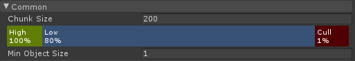

# HLOD

This component is used to generate HLOD data-structure for static objects.

## Common

Typical setting related to HLOD.

**Chunk Size**: For our hierarchy with HLOD component, we define a 
number of detail levels where each level represents one way to group 
the meshes into a number of merged meshes. On the top level, all 
meshes are merged together. On the next level, we partition the meshes 
into 4 merged mesh (we do not partition along height axis, but only 
across the horizontal plane). In this way, the HLOD system builds a 
quadtree data structure.

The "Chunk Size" setting sets the size of the "terminal node" of the
HLOD quadtree. Nodes are split into quadtrees until they are smaller
than this value at full size.

**High/Low/Cull**: This setting defines a function that categorize a
mesh into 3 categories: *High*, *Low*, and *Cull*. Looking at the
above setting as an example, if a mesh has AABB projected onto the
screen occupying less than 1% of the screen, it is categorized as
"Cull". If a mesh has AABB projected onto the screen occupying more
than 80% of the screen, it is categorized as "High".

When rendering HLOD mesh hierarchy, we traverse the HLOD quadtree. If
the root HLOD mesh is "Low", we render just the combined HLOD mesh. If
the root HLOD mesh is "Cull", we render nothing. If the root HLOD mesh
is "High", we look at the children of the HLOD root node and decide
how to render each children recursively in the same fashion.

**Min Object Size**: Specifies the minimal size for a mesh to be
included in the HLOD data-structure. If the size of a mesh is greater
than the set value, it is included in the HLOD system. If a mesh is
too small, it is excluded from the HLOD mesh.

## Simplifier

See section [Simplifier](Simplifier.md).

## Batcher

See section [Batcher](Batcher.md).

## Streaming

See section [Streaming](Streaming.md).