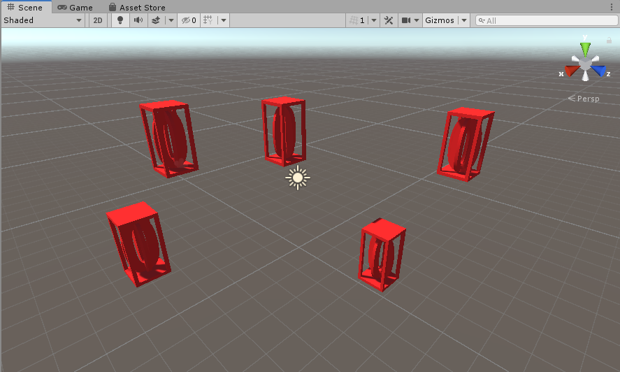
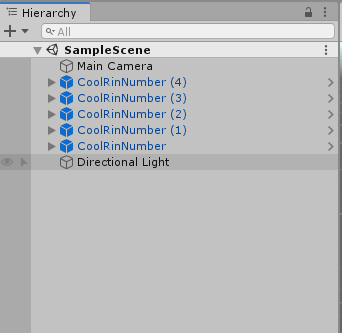
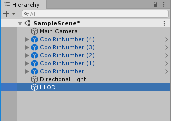
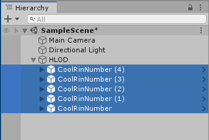
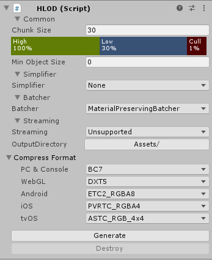
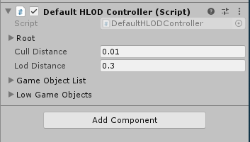
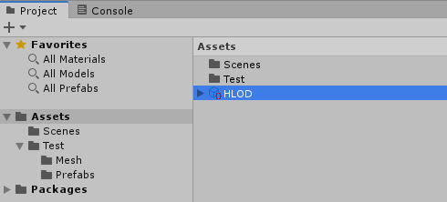
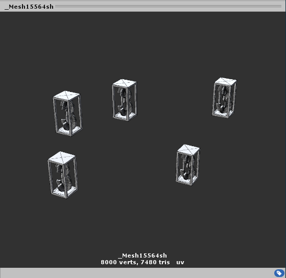

# Using HLOD in the Project

## Creating the Test Scene

You can follow through the steps and create the test scene with necessary object to use with HLOD, or you can download the Test Scene created in advance and just apply HLOD.

**Step 1.** Create a new scene and place objects in it. Let's say, 5 of them. The objects must be:
-   Static
-   With albedo material
-   Add some more features

HLOD does not work with objects that are not static, have animated mesh, or are destroyed during game-play.

This is how Hierarchy Window looks like after we added our Game Objects:

## Applying HLOD to Objects

**Step 1.** Create an empty Game Object and name it HLOD or anything else you would like it to be:

**Step 2.** Select your game objects and make them the children of HLOD Game Object:

**Step 3.** Select HLOD Game Object and add HLOD Component to it in Inspector, then click Generate:

For a detailed explanation of the settings of HLOD Component, see [HLOD](HLOD.md).

A Default HLOD Controller Component will be added automatically:

The HLOD Data Structure will be created in the path which OutputDirectory parameter of HLOD Component points to:

If you expand HLOD Data Structure and click the mesh component of it, you can see how Game Object Meshes are combined into a single mesh:

**Step 4.** Click Destroy button if you want to destroy and/or re-generate HLOD for a given Game Object.
