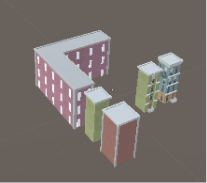
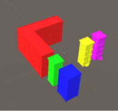
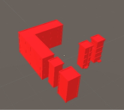

# HLOD

It can replace multiple Static Mesh Actors with single, combined Static Mesh Actor at long view distances. This helps reduce the number of Actors that need to be rendered for the scene, increasing performance by lowering the number of draw calls per frame.

| Render image              | Show draw calls           | Show draw calls of HLOD   |
| ------------------------- | ------------------------- | ------------------------- |
|  |  |  |

## Getting started with HLODSystem

For information on starting with HLOD package, see section [Getting started](GettingStarted.md).

## Using HLOD in the Project

For information on simple HLODSystem usage, see section [Using HLOD](UsingHLOD.md).

## Component

HLODSystem provides 2 components used to build 2 types of HLOD data-structure:

### HLOD
See section [HLOD](HLOD.md).

### TerrainHLOD
See section [TerrainHLOD](TerrainHLOD.md).
